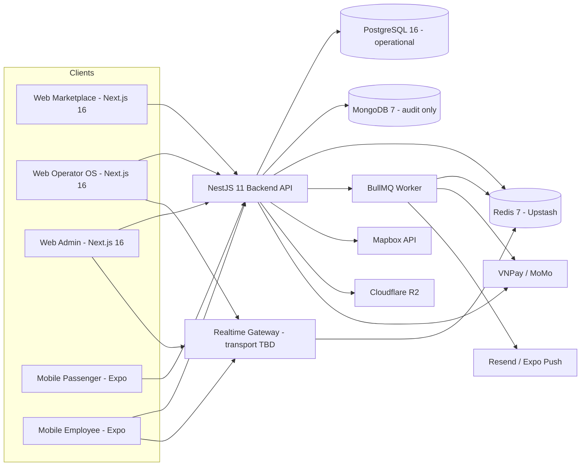
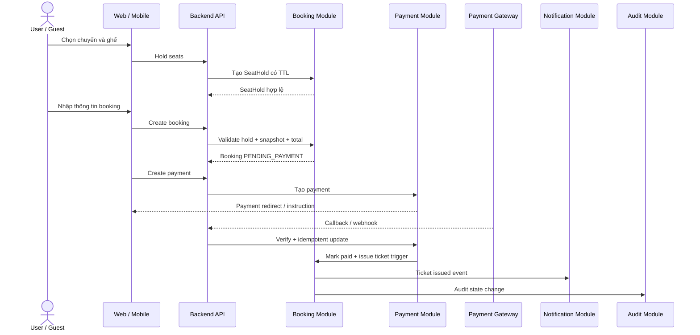
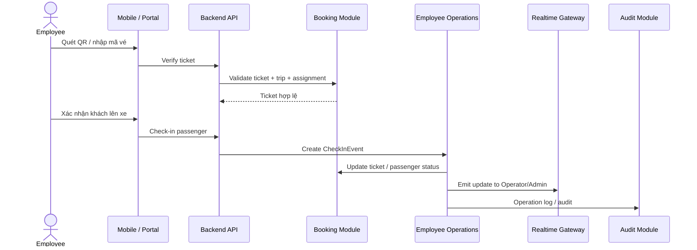
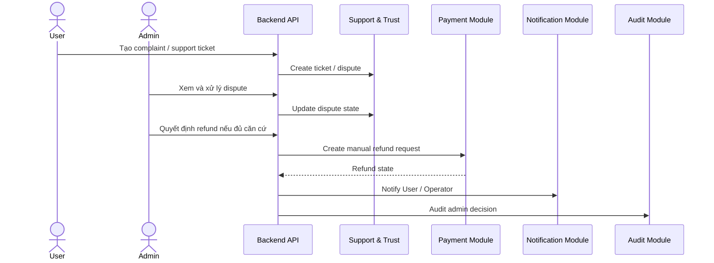

# 02. High Level Design - Hệ thống đặt vé xe khách

## 1. Thông tin tài liệu

### 1.1. Metadata

| Thuộc tính    | Giá trị                                      |
| ------------- | -------------------------------------------- |
| Tên tài liệu  | High Level Design - Hệ thống đặt vé xe khách |
| Mã tài liệu   | 02-hld-he-thong-dat-ve-xe-khach              |
| Dự án         | Marketplace-Ve-Xe-Nhanh                      |
| Phiên bản     | v0.4                                         |
| Trạng thái    | Approved                                     |
| Người viết    | Nguyễn Hồng Khanh, AI Agent                  |
| Người duyệt   | Nguyễn Hồng Khanh                            |
| Ngày tạo      | 11/05/2026                                   |
| Ngày cập nhật | 01/06/2026                                   |

### 1.2. Lịch sử thay đổi

| Phiên bản | Ngày       | Người cập nhật | Nội dung thay đổi                                                                                                                                                                                                                                                                                                                                                                                                                                                                                                                                                                      |
| --------- | ---------- | -------------- | -------------------------------------------------------------------------------------------------------------------------------------------------------------------------------------------------------------------------------------------------------------------------------------------------------------------------------------------------------------------------------------------------------------------------------------------------------------------------------------------------------------------------------------------------------------------------------------- |
| v0.1      | 11/05/2026 | AI Agent       | Tạo bản nháp HLD từ SRS `01-srs-he-thong-dat-ve-xe-khach.md` và context hiện tại                                                                                                                                                                                                                                                                                                                                                                                                                                                                                                       |
| v0.2      | 25/05/2026 | AI Agent       | Align với `context/DOMAIN-MAP`, `context/GLOSSARY`, `context/PROJECT-STATE`; cập nhật module boundary sang target state; đóng HLD-OQ-02..08 theo các OQ đã chốt; bổ sung VNPay Sandbox và Email OTP                                                                                                                                                                                                                                                                                                                                                                                    |
| v0.3      | 25/05/2026 | AI Agent       | Rebrand sang `Marketplace-Ve-Xe-Nhanh`; gỡ tham chiếu tới 2 context file đã xóa `PROJECT-STRUCTURE.md` và `TECH-STACK.md` ở §4.1. Không thay đổi nội dung normative.                                                                                                                                                                                                                                                                                                                                                                                                                   |
| v0.4      | 01/06/2026 | AI Agent       | **Sprint 5 Rework** — reset toàn bộ tech stack theo 18 ADR đã chốt (ADR-002, ADR-009..022): Hybrid-A DB (Postgres+Prisma ops / Mongo audit cluster riêng), nestjs-zod, BullMQ, Redis Upstash, Better Auth 3-namespace, Next.js 16 monorepo, Expo 2-app, VNPay+MoMo, Resend+Expo Push+OAuth, Mapbox, R2, manual payout. Đóng HLD-OQ-09 (R2), HLD-OQ-10 (manual payout); cập nhật HLD-OQ-07 (Mongo cluster riêng). Raise HLD-OQ-11 (realtime transport chưa thuộc 15-layer selection). Reframe §4.3 giả định, §5 kiến trúc, §13 tích hợp ngoài, §14 deployment, §16 quyết định theo ADR. |

---

## 2. Mục lục

1. Thông tin tài liệu
2. Mục lục
3. Giới thiệu
4. Nguồn đầu vào và phạm vi thiết kế
5. Kiến trúc tổng quan
6. Client architecture
7. Backend architecture
8. Module boundary
9. Data ownership mức cao
10. Luồng tích hợp chính
11. Bảo mật và phân quyền mức cao
12. Realtime, queue và background job
13. Tích hợp ngoài
14. Deployment overview
15. Mapping yêu cầu phi chức năng
16. Quyết định thiết kế
17. Rủi ro kiến trúc
18. Open Questions / TBD
19. Phụ lục

---

## 3. Giới thiệu

### 3.1. Mục đích tài liệu

Tài liệu này mô tả thiết kế kiến trúc mức cao cho hệ thống đặt vé xe khách. HLD là cầu nối giữa SRS và các tài liệu thiết kế chi tiết như LLD, Database Design, API Specification, Security Design và UI/UX Flow.

### 3.2. Đối tượng đọc

| Đối tượng    | Mục đích đọc                                                        |
| ------------ | ------------------------------------------------------------------- |
| Kiến trúc sư | Chốt boundary hệ thống, module và tích hợp                          |
| Backend dev  | Hiểu module backend, data ownership, queue, realtime và integration |
| Frontend dev | Hiểu client boundary, portal, auth flow và API dependency           |
| Mobile dev   | Hiểu phạm vi app Passenger / Employee và offline / sync requirement |
| QA / Tester  | Chuẩn bị test strategy theo module và luồng nghiệp vụ chính         |
| Người duyệt  | Xác nhận thiết kế không vượt phạm vi SRS                            |

### 3.3. Phạm vi tài liệu

Tài liệu này mô tả kiến trúc mức cao, module boundary, trách nhiệm chính, luồng giao tiếp, dữ liệu sở hữu, security boundary và deployment overview.

Tài liệu này KHÔNG mô tả chi tiết schema, migration, DTO, endpoint, UI screen state hoặc thuật toán nội bộ. Các nội dung đó thuộc `03-lld-he-thong-dat-ve-xe-khach.md`, `04-database-design.md`, `05-api-specification.md`, `06-ui-ux-flow-specification.md` và `07-security-permission-design.md`.

---

## 4. Nguồn đầu vào và phạm vi thiết kế

### 4.1. Tài liệu đầu vào

| Mã / File                                    | Vai trò trong HLD                                                                                                     |
| -------------------------------------------- | --------------------------------------------------------------------------------------------------------------------- |
| `00-quy-chuan-cho-lap-trinh-vien.md`         | Quy chuẩn SDLC và điều kiện dùng tài liệu để triển khai                                                               |
| `01-srs-he-thong-dat-ve-xe-khach.md` (v1.20) | Nguồn yêu cầu chính, các FR/BR/NFR và OQ đã chốt                                                                      |
| `10-architecture-decision-record.md` (v0.21) | **Toàn bộ ADR chốt tech stack + DevOps** (ADR-002, ADR-009..026) — nguồn chuẩn cho mọi quyết định công nghệ trong HLD |
| `context/DOMAIN-MAP.md`                      | Mapping ba lớp dịch vụ ↔ module backend ở trạng thái target                                                           |
| `context/GLOSSARY.md`                        | Thuật ngữ song ngữ Việt - Anh, nguồn đặt tên chuẩn                                                                    |
| `context/PROJECT-STATE.md`                   | Trạng thái tài liệu, quyết định chiến lược và OQ/MQ đã chốt                                                           |

### 4.2. Phạm vi thiết kế trong bản nháp

| Phạm vi                 | Trạng thái trong HLD | Ghi chú                                                                                                   |
| ----------------------- | -------------------- | --------------------------------------------------------------------------------------------------------- |
| Marketplace layer       | Có                   | User / Guest search, booking, payment, ticket, support                                                    |
| Operator OS layer       | Có                   | Operator profile, resources, trips, finance, employee                                                     |
| Platform admin layer    | Có                   | KYC, catalog, policy, payment, dispute, audit                                                             |
| Mobile Passenger        | Có                   | App riêng `apps/passenger-mobile` (ADR-014)                                                               |
| Mobile Employee         | Có                   | App riêng `apps/employee-mobile` — check-in, trip status, journey log, incident, background geo (ADR-014) |
| External Operator API   | Ngoài phạm vi v1     | Theo SRS §6.4                                                                                             |
| Multi-language/currency | Ngoài phạm vi v1     | Theo SRS §6.4 và OQ-12                                                                                    |

### 4.3. Tiền đề thiết kế (theo ADR đã chốt)

Các tiền đề dưới đây không còn là giả định mở; chúng phản ánh quyết định công nghệ đã chốt trong các ADR (`PROJECT-STATE §1`, file 10 v0.21). Adapter boundary vẫn giữ để vendor swappable (ADR-006).

| ID        | Tiền đề (grounded in ADR)                                                                                                                                                                                                    | Tham chiếu                |
| --------- | ---------------------------------------------------------------------------------------------------------------------------------------------------------------------------------------------------------------------------- | ------------------------- |
| HLD-AS-01 | Backend = NestJS 11 modular monolith (framework-agnostic boundary) trong monorepo Turborepo `apps/api/`, 1 module per business domain theo DOMAIN-MAP §1, §2.                                                                | ADR-002, ADR-010          |
| HLD-AS-02 | Persistence Hybrid-A: **Postgres 16 + Prisma 5** cho toàn bộ operational; **MongoDB 7 + Mongoose** cluster RIÊNG cho audit/log (append-only); **Redis 7 (Upstash)** cho cache + distributed lock + BullMQ backend.           | ADR-011, ADR-015, ADR-016 |
| HLD-AS-03 | Frontend web = **Next.js 16 App Router** trong Turborepo + pnpm monorepo; Marketplace RSC+SSG/ISR cho SEO, Operator OS + Admin CSR sau auth. Số app cụ thể chốt LLD.                                                         | ADR-013                   |
| HLD-AS-04 | Mobile = **Expo (managed) SDK 55+** New Architecture, **2 app tách biệt**: `apps/passenger-mobile` (public) + `apps/employee-mobile` (internal, background geo).                                                             | ADR-014                   |
| HLD-AS-05 | Vendor tích hợp ngoài đã chốt (payment VNPay+MoMo, email Resend, push Expo, OAuth Google/FB/Apple, routing Mapbox, storage R2, payout manual); mọi vendor đứng sau adapter port `external/<provider>/` để swap không phá vỡ. | ADR-018..022, ADR-006     |

---

## 5. Kiến trúc tổng quan

### 5.1. Mô hình kiến trúc

Hệ thống dùng mô hình **modular monolith** ở v1 (ADR-002): một backend process NestJS 11 phục vụ nhiều client, các module nghiệp vụ tách boundary rõ (enforce qua ESLint custom rule theo DOMAIN-MAP §1, §2) để strangler-ready — có thể tách sang service riêng qua `@nestjs/microservices` khi tải hoặc yêu cầu vận hành tăng.

### 5.2. Kiến trúc logic theo lớp

| Lớp                    | Trách nhiệm chính                                                                        | Công nghệ / thành phần                                                          |
| ---------------------- | ---------------------------------------------------------------------------------------- | ------------------------------------------------------------------------------- |
| Client presentation    | UI, form state, route, hiển thị loading/error/empty, gọi API                             | Next.js 16 (App Router), React 19, Expo SDK 55+ (2 app); component lib chốt LLD |
| API application layer  | Auth, validation, RBAC, use case orchestration, transaction boundary mức service         | NestJS 11 controller / service / guard / pipe / interceptor + nestjs-zod        |
| Domain module layer    | Booking, payment, trip, operator, employee, support, notification, audit                 | NestJS modules (1 module per domain)                                            |
| Persistence layer      | Schema, repository/query, index, state history, soft delete                              | PostgreSQL 16 + Prisma 5 (operational); MongoDB 7 + Mongoose (audit-only)       |
| Async processing layer | Payment callback retry, notification fan-out, payout cron T+3, reconciliation, reporting | BullMQ + @nestjs/bullmq trên Redis 7 (Upstash)                                  |
| Realtime layer         | Trip update, check-in sync, notification realtime, admin/operator monitoring             | Transport TBD (chưa thuộc 15-layer selection — xem HLD-OQ-11)                   |
| Integration layer      | Payment, notification, routing/map, object storage, payout                               | Adapter pattern `external/<provider>/`; vendor đã chốt (ADR-018..022)           |

### 5.3. Nguyên tắc kiến trúc

| ID          | Nguyên tắc                                                                                                                                                                       |
| ----------- | -------------------------------------------------------------------------------------------------------------------------------------------------------------------------------- |
| HLD-PRIN-01 | Backend là nguồn kiểm tra cuối cùng cho RBAC, tenant boundary, seat state và payment state.                                                                                      |
| HLD-PRIN-02 | Controller chỉ xử lý transport, validation sơ bộ và gọi service; business logic nằm trong module.                                                                                |
| HLD-PRIN-03 | Mọi thao tác tiền, vé, ghế, policy và quyền phải idempotent hoặc có audit/state history phù hợp.                                                                                 |
| HLD-PRIN-04 | Mọi provider ngoài (payment, notification, routing, storage, payout) đứng sau adapter port `external/<provider>/`; không gọi SDK vendor trực tiếp trong domain module (ADR-006). |
| HLD-PRIN-05 | Module có dữ liệu theo Operator phải luôn lọc theo `operatorId` / tenant boundary; defense-in-depth = TenantGuard + Postgres RLS (ADR-011, ADR-017).                             |
| HLD-PRIN-06 | Mọi giá trị tiền tệ = VND lưu `BIGINT`; tính toán dùng Decimal.js / BigInt, **cấm `number` raw**; validate boundary bằng Zod (ADR-009, ADR-011).                                 |

---

## 6. Client architecture

### 6.1. Web frontend

Web = Next.js 16 App Router trong Turborepo monorepo (ADR-013). Định hướng tách app theo lớp dịch vụ; số app cụ thể (3 app riêng vs 2 app gộp back-office) chốt ở LLD.

| App / vùng dịch vụ | Actor chính        | Render & Vai trò                                                                     |
| ------------------ | ------------------ | ------------------------------------------------------------------------------------ |
| Marketplace        | User, Guest        | RSC + SSG/ISR cho SEO; search, trip detail, booking, payment redirect, ticket lookup |
| Operator OS        | Operator, Employee | CSR sau auth; operator profile, vehicle, route, trip, booking, employee, finance     |
| Admin              | Admin              | CSR sau auth; KYC, catalog, policy, payment/refund, dispute, report, audit           |

### 6.2. Mobile app

Mobile = Expo managed SDK 55+, **2 app tách biệt** cùng monorepo, share `packages/types + api-client + ui-mobile-shared` (ADR-014).

| App                     | Actor    | Chức năng chính                                                                                             |
| ----------------------- | -------- | ----------------------------------------------------------------------------------------------------------- |
| `apps/passenger-mobile` | User     | Search, booking, ticket, notification, support; permission minimal, ASO marketing                           |
| `apps/employee-mobile`  | Employee | Assigned trips, passenger list, QR check-in, trip status, incident report; background geo + full permission |

### 6.3. Client state

| Loại state     | Nơi xử lý khuyến nghị               | Ghi chú                                                       |
| -------------- | ----------------------------------- | ------------------------------------------------------------- |
| Server state   | React Query (khuyến nghị, chốt LLD) | Booking, ticket, trip, operator, catalog, report              |
| Local UI state | Component state / Zustand           | Filter, modal, selected seat, stepper state                   |
| Auth/session   | Better Auth client + secure storage | Web = httpOnly cookie; Mobile = `expo-secure-store` (ADR-017) |
| Form state     | React Hook Form + Zod schema        | Backend vẫn phải validate lại bằng nestjs-zod                 |

---

## 7. Backend architecture

### 7.1. Backend layer nội bộ

| Layer                       | Vai trò                                                                                              |
| --------------------------- | ---------------------------------------------------------------------------------------------------- |
| Controller / Gateway        | Nhận HTTP / realtime request, gọi guard, pipe, Zod validation và service                             |
| Application service         | Điều phối use case, kiểm state, gọi repository, queue, integration adapter                           |
| Domain policy / helper      | Tính giá, policy refund, permission check, seat state, commission, payout condition                  |
| Repository / model          | Truy vấn Postgres qua Prisma (atomic update, index-aware, soft delete); Mongo qua Mongoose cho audit |
| Integration adapter         | Payment, notification, routing, object storage, payout (`external/<provider>/`)                      |
| Queue processor / scheduler | Retry, reconciliation, notification fan-out, payout cron T+3, reporting export, cleanup expired hold |

### 7.2. Cross-cutting backend concern

| Concern        | Thiết kế mức cao                                                                                                                                                                      |
| -------------- | ------------------------------------------------------------------------------------------------------------------------------------------------------------------------------------- |
| Authentication | Better Auth + custom NestJS adapter; Hybrid token JWT RS256 15min access + opaque refresh 30d (rotation + family invalidation); force revoke khi khóa tài khoản / đổi quyền (ADR-017) |
| Authorization  | Guard kiểm role (RBAC 8 role enum v1), permission và tenant boundary ở backend                                                                                                        |
| Validation     | **nestjs-zod** (Zod single source cho validate + OpenAPI + TS type); rule nghiệp vụ kiểm trong service (ADR-010, ADR-012)                                                             |
| Rate limiting  | Áp dụng cho login, OTP, search, seat hold, payment, ticket lookup                                                                                                                     |
| Audit          | Ghi AuditLog (Mongo cluster riêng, append-only) cho thao tác nhạy cảm, tối thiểu actor, action, target, before/after, reason                                                          |
| Logging        | Không log plaintext token, OTP, mật khẩu hoặc dữ liệu thanh toán nhạy cảm                                                                                                             |
| Error handling | Business error code ổn định; response theo RFC 7807 (ADR-012)                                                                                                                         |

---

## 8. Module boundary

### 8.1. Module nghiệp vụ chính

Bảng module HLD dưới đây dùng tên **target state** theo `context/DOMAIN-MAP §1, §2`. Tên module singular (vd `vehicle/`, `booking/`, `trip/`, `iam/auth/`); boundary enforce qua ESLint custom rule (ADR-010).

| Module HLD                   | Backend module nhóm (target)                                                                                                                                                                                  | Trách nhiệm chính                                                                                                                               | Actor dùng chính                |
| ---------------------------- | ------------------------------------------------------------------------------------------------------------------------------------------------------------------------------------------------------------- | ----------------------------------------------------------------------------------------------------------------------------------------------- | ------------------------------- |
| Identity & Access Management | `iam/auth/`, `iam/user/`, `iam/session/`, `iam/role/`                                                                                                                                                         | Đăng ký, đăng nhập, session, role, permission, account status; 3 namespace identity (Passenger Email / Operator `{slug}/{username}` / Platform) | User, Operator, Employee, Admin |
| Operator Profile & KYC       | `operator/`, `operator-kyc/`                                                                                                                                                                                  | Operator profile, hồ sơ KYC, bank account, status history                                                                                       | Operator, Admin                 |
| Marketplace Search           | `search/`, `catalog/`                                                                                                                                                                                         | Search chuyến, filter, sort, public trip availability; catalog do Platform quản lý                                                              | User, Guest                     |
| Transport Resource           | `vehicle/`, `route/`, `stop-point/`                                                                                                                                                                           | Vehicle, VehicleType, SeatMap, Route, RouteStop, StopPoint (Operator-owned phần)                                                                | Operator, Admin                 |
| Trip & Inventory             | `trip/`, `trip-seat/`, `seat-hold/`, `fare/`                                                                                                                                                                  | Trip, TripStop, TripSeat, SeatHold (10 phút TTL, Redis), Fare, FareRule                                                                         | Operator, User, Guest, Employee |
| Booking & Ticket             | `booking/`, `ticket/`                                                                                                                                                                                         | Booking, PassengerInfo, Ticket, QR token, BookingStatusHistory, snapshot                                                                        | User, Guest, Operator, Employee |
| Payment & Refund             | `payment/`, `refund/`                                                                                                                                                                                         | Payment intent, callback verify, refund, idempotency, reconciliation                                                                            | User, Operator, Admin           |
| Escrow & Payout & Commission | `escrow/`, `payout/`, `commission/`                                                                                                                                                                           | EscrowLedger append-only (in-house, ADR-005), commission rule, payout T+3 manual confirm                                                        | Operator, Admin                 |
| Promotion                    | `promotion/`                                                                                                                                                                                                  | Promotion, PromotionRule, PromotionRedemption, PromotionUsageLimit                                                                              | User, Operator, Admin           |
| Employee Operations          | `employee/`, `manifest/`, `check-in/`, `journey-log/`, `incident/`                                                                                                                                            | Assignment, manifest, check-in QR, trip status, journey log, incident report                                                                    | Employee, Operator              |
| Support & Trust              | `support/`, `complaint/`, `review/`, `dispute/`, `scorecard/`                                                                                                                                                 | SupportTicket, Complaint, Review, DisputeCase, OperatorScorecard                                                                                | User, Operator, Admin           |
| Notification                 | `notification/`                                                                                                                                                                                               | Notification event, delivery (email/push/sms-noop), retry, NotificationPreference                                                               | Hệ thống, mọi actor             |
| Reporting                    | `reporting/`                                                                                                                                                                                                  | Dashboard; Postgres CTE/materialized view (structured) + Mongo aggregation (audit); async export                                                | Operator, Admin                 |
| Audit & Policy               | `audit/`, `policy/`                                                                                                                                                                                           | AuditLog (Mongo cluster riêng, append-only), PolicyVersion, PolicySnapshot                                                                      | Admin, hệ thống                 |
| Cross-cutting                | `common/`, `database/` (Prisma + Mongoose), `redis/`, `external/payment/{vnpay,momo}/`, `external/notification/{email,push,sms}/`, `external/routing/{mapbox,osrm}/`, `external/storage/`, `external/payout/` | Guard, interceptor, pipe, adapter cho provider ngoài                                                                                            | Hệ thống                        |

### 8.2. Module phụ thuộc trọng yếu

| Module nguồn        | Phụ thuộc vào                                               | Lý do phụ thuộc                                                  |
| ------------------- | ----------------------------------------------------------- | ---------------------------------------------------------------- |
| Booking & Ticket    | Transport Resource, Payment, Promotion, Notification, Audit | Giữ ghế, tính tiền, phát hành vé, gửi thông báo, ghi log         |
| Payment             | Booking & Ticket, Escrow, Notification, Audit               | Cập nhật booking/payment/refund, ghi escrow, thông báo, truy vết |
| Employee Operations | Booking & Ticket, Transport Resource, Notification, Audit   | Check-in, trạng thái chuyến, sự cố, đồng bộ vận hành             |
| Support & Trust     | Booking & Ticket, Payment, Operator, Notification, Audit    | Khiếu nại, tranh chấp, review, scorecard                         |
| Reporting           | Booking, Payment, Trip, Operator, Support, Audit            | Dashboard và export                                              |

---

## 9. Data ownership mức cao

Dữ liệu operational nằm ở **Postgres** (Prisma); riêng AuditLog/notification_log nằm ở **Mongo cluster riêng** (append-only, ADR-011). Money column = `BIGINT` VND (ADR-009/011).

| Nhóm dữ liệu                 | Module sở hữu chính         | Module được đọc / ghi phụ                        | Ghi chú thiết kế                                                                      |
| ---------------------------- | --------------------------- | ------------------------------------------------ | ------------------------------------------------------------------------------------- |
| User / Session               | Identity & Access           | Audit, Notification                              | Session metadata cache Redis; không lộ token / OTP trong log                          |
| Operator / KYC               | Identity & Access, Operator | Admin, Payment, Reporting                        | Operator phải được duyệt trước khi mở bán; KYC doc ở R2 private bucket                |
| Vehicle / SeatMap            | Transport Resource          | Booking, Employee Operations, Reporting          | Thay đổi sau khi có vé bán phải kiểm policy                                           |
| Route / StopPoint            | Transport Resource          | Search, Booking, Routing                         | StopPoint chuẩn do Platform quản lý hoặc duyệt; toạ độ cache distance/duration Mapbox |
| Trip / TripSeat              | Transport Resource          | Search, Booking, Employee Operations             | Ghế theo chuyến là tài nguyên giao dịch                                               |
| SeatHold                     | Booking & Ticket            | Search                                           | Redis `SET NX EX 600` (10 phút TTL, ADR-015)                                          |
| Booking / Ticket             | Booking & Ticket            | Payment, Support, Employee Operations, Reporting | Lưu snapshot bắt buộc theo SRS                                                        |
| Payment / Refund             | Payment                     | Booking, Support, Reporting, Audit               | Callback / refund phải idempotent; dedup `(provider, providerTxnId)`                  |
| Escrow / Payout              | Escrow, Payout              | Operator, Admin, Reporting                       | EscrowLedger append-only in-house; payout đối soát hai chiều                          |
| Review / Complaint / Dispute | Support & Trust             | Operator, Admin, Reporting                       | Attachment ở R2 private bucket nếu có                                                 |
| Notification                 | Notification                | Mọi module phát event                            | Delivery status riêng theo kênh; `notification_log` ở Mongo                           |
| AuditLog                     | Audit                       | Mọi module ghi, Admin đọc                        | Mongo cluster riêng, append-only (REVOKE UPDATE/DELETE)                               |

---

## 10. Luồng tích hợp chính

### 10.1. Luồng đặt vé và thanh toán

### 10.2. Luồng check-in

### 10.3. Luồng dispute / refund thủ công

---

## 11. Bảo mật và phân quyền mức cao

| Chủ đề                    | Thiết kế mức cao                                                                                                                                                                                                      |
| ------------------------- | --------------------------------------------------------------------------------------------------------------------------------------------------------------------------------------------------------------------- |
| Actor & Identity boundary | 3 namespace tách biệt (ADR-017): Passenger = Email (OTP primary); Operator-side = `{operatorSlug}/{username}`; Platform-side = `platform/{username}`. Mỗi `(scope, username)` là account riêng (Account-separate v1). |
| Provisioning              | Closed enrollment (ADR-017): Platform admin cấp Operator slug + first Owner sau KYC; Operator owner cấp employee; Passenger self-register Email+OTP.                                                                  |
| Tenant boundary           | Operator/Employee chỉ truy cập dữ liệu theo `operatorId`; defense-in-depth = NestJS `TenantGuard` (JWT claims) + Postgres RLS `SET LOCAL app.operator_slug` (ADR-011, ADR-017).                                       |
| Admin access              | RBAC 8 role hardcoded enum v1 (Anonymous / Passenger / OperatorOwner / Driver / TicketStaff / SupportStaff / PlatformAdmin / PlatformSupport); thao tác nhạy cảm cần audit + TOTP.                                    |
| Token / session           | Hybrid: JWT RS256 15min access (httpOnly cookie Web + expo-secure-store Mobile) + opaque 32-byte refresh 30d, rotation + family invalidation; Redis cache session metadata (ADR-017).                                 |
| MFA                       | TOTP mandatory Owner / PlatformAdmin / PlatformSupport + 10 backup code single-use; optional Driver / TicketStaff / SupportStaff v1 (ADR-017).                                                                        |
| Sensitive action          | Refund, payout, đổi bank account, đổi policy, khóa Operator, sửa chuyến đã bán vé.                                                                                                                                    |
| Data masking              | Số điện thoại / PII chỉ hiển thị đầy đủ khi có quyền và lý do vận hành (`0*** *** 789`).                                                                                                                              |
| QR ticket                 | QR token không đoán được, xác thực server-side, có thể revoke / rotate.                                                                                                                                               |
| Object storage bảo mật    | KYC / dispute / payment-proof = R2 private bucket, presigned URL TTL 5min + audit log mỗi access (ADR-018).                                                                                                           |

Chi tiết permission matrix, threat control, re-auth rule và audit rule sẽ được chốt trong `07-security-permission-design.md`. ⚠️ ADR-017 (token/identity) cần **re-confirm CRITICAL** khi rework 07 Security (Khanh chốt vòng 1 qua "[No preference]").

---

## 12. Realtime, queue và background job

### 12.1. Realtime event

Các event dưới đây cần đẩy tới client gần thời gian thực. **Transport realtime (Socket.IO / SSE / polling) chưa nằm trong 15-layer tech selection** — xem HLD-OQ-11; v1 có thể dùng polling nếu chưa chốt.

| Event nhóm              | Người nhận chính      | Mục đích                                             |
| ----------------------- | --------------------- | ---------------------------------------------------- |
| Booking / ticket update | User, Operator        | Cập nhật trạng thái booking, ticket, danh sách khách |
| Trip operation update   | Operator, Admin       | Cập nhật trạng thái chuyến, check-in, sự cố          |
| Employee assignment     | Employee              | Nhận nhiệm vụ / chuyến được phân công                |
| Dispute update          | User, Operator, Admin | Theo dõi trạng thái tranh chấp                       |
| System maintenance      | Mọi actor liên quan   | Thông báo bảo trì / gián đoạn                        |

### 12.2. Background job

Job chạy trên **BullMQ + @nestjs/bullmq** (Redis Upstash, ADR-016); worker chạy **Render Background Worker tách** (cùng image, khác start command — ADR-024).

| Job                          | Trigger                        | Kết quả mong muốn                                                                 |
| ---------------------------- | ------------------------------ | --------------------------------------------------------------------------------- |
| Expire SeatHold              | Redis TTL 600s                 | Giải phóng ghế giữ quá hạn                                                        |
| Payment callback retry       | Callback lỗi / timeout         | Xử lý lại an toàn, idempotent (exponential retry + DLQ)                           |
| Payment reconciliation       | BullMQ cron / admin trigger    | Call querydr mỗi cổng, đồng bộ lệch trạng thái payment (ADR-019)                  |
| Refund reconciliation        | BullMQ cron / admin trigger    | Đồng bộ lệch trạng thái refund                                                    |
| Notification fan-out + retry | Business event                 | Fan-out email + push + sms-noop song song; retry + DLQ + `notification_log`       |
| Reporting export             | Báo cáo lớn                    | Tạo file bất đồng bộ và thông báo khi hoàn tất                                    |
| Payout calculation T+3       | Cron `0 0 * * *` concurrency 1 | Gom escrow eligible − commission − refund − adjustment → Payout PENDING (ADR-022) |
| Audit archive                | Retention policy - TBD         | Archive log Mongo theo chính sách dữ liệu                                         |

---

## 13. Tích hợp ngoài

Tất cả vendor đứng sau adapter port `external/<provider>/` (ADR-006). Webhook async qua BullMQ (Layer 9) + verify HMAC + idempotent dedup.

| Tích hợp          | Quyết định v1                                           | Boundary thiết kế trong HLD                                                                                                             |
| ----------------- | ------------------------------------------------------- | --------------------------------------------------------------------------------------------------------------------------------------- |
| Payment gateway   | **VNPay primary + MoMo phương thức 2** (ADR-019)        | `external/payment/{vnpay,momo}/`; VnpayAdapter HMAC-SHA512, MomoAdapter HMAC-SHA256; verify callback + idempotency key; escrow in-house |
| Email             | **Resend** (ADR-020)                                    | `external/notification/email/`; React Email templates; fan-out async qua BullMQ                                                         |
| SMS               | **Defer v1** (ADR-020)                                  | `external/notification/sms/` chỉ adapter port + LocalLoggerAdapter; kích hoạt v1.x (eSMS.vn candidate)                                  |
| Push notification | **Expo Push Service** — trong phạm vi v1 (ADR-020)      | `external/notification/push/`; `expo-server-sdk-node` route FCM + APNs                                                                  |
| OAuth provider    | **Google + Facebook + Apple**, Passenger-only (ADR-020) | Better Auth built-in providers; Apple Sign-In mandatory App Store 4.8; Operator/Platform không OAuth                                    |
| Routing + map     | **Mapbox** Matrix/Directions + GL (ADR-021)             | `external/routing/mapbox/`; distance/duration cache DB; `external/routing/osrm/` = escape-hatch self-host                               |
| Object storage    | **Cloudflare R2** (ADR-018)                             | `external/storage/`; 2 bucket public/private; `@aws-sdk/client-s3` (S3-compatible); KYC production location defer OQ-21                 |
| Bank payout       | **Manual admin-confirm + batch** (ADR-022)              | `external/payout/`; `ManualPayoutAdapter`; auto-disbursement defer v1.x tied OQ-22                                                      |
| Cache + lock      | **Redis 7 (Upstash managed SG)** (ADR-015)              | `redis/`; `ioredis` + cache-manager + custom lock service (`SET NX EX` + Lua release)                                                   |

---

## 14. Deployment overview

### 14.1. Môi trường

| Môi trường | Mục đích                           | Ghi chú                                                                                                                                         |
| ---------- | ---------------------------------- | ----------------------------------------------------------------------------------------------------------------------------------------------- |
| Local      | Dev, test thủ công, docker-compose | Postgres + Mongo local; Redis = Upstash managed (hoặc local redis dev); Mapbox/R2 = API key; storage KYC dev = local adapter (filesystem/MinIO) |
| Staging    | Kiểm thử tích hợp trước production | Cần sandbox VNPay/MoMo + Resend + Expo Push                                                                                                     |
| Production | Vận hành thật                      | Cần HTTPS, backup, monitoring, secret manager; **blocker OQ-21 (KYC storage) + OQ-22 (giấy phép TGTT)**                                         |

### 14.2. Thành phần triển khai

Deploy target + CI-CD + monitoring đã chốt Phase 4 (Sprint 4): **Render managed PaaS (SG)** + GitHub Actions + Sentry (ADR-023/024/026). DB managed-separate Supabase/Neon + Atlas SG. Bảng thành phần triển khai:

| Thành phần           | Vai trò                                                                                                            |
| -------------------- | ------------------------------------------------------------------------------------------------------------------ |
| Backend API          | HTTP API, realtime gateway, queue producer                                                                         |
| BullMQ worker        | Payment/notification/reconciliation/payout/reporting jobs; **Render Background Worker tách** (cùng image, ADR-024) |
| PostgreSQL 16        | Operational database (Prisma)                                                                                      |
| MongoDB 7            | Audit / log (cluster riêng, append-only)                                                                           |
| Redis 7 (Upstash)    | Cache, distributed lock, BullMQ backend (managed SG)                                                               |
| Web frontend         | Marketplace, Operator OS, Admin (Next.js 16 monorepo)                                                              |
| Mobile app           | Passenger app + Employee app (EAS Build / Update / Submit)                                                         |
| Routing              | Mapbox API (managed); OSRM self-host = escape-hatch                                                                |
| Object storage       | Cloudflare R2 (2 bucket public/private)                                                                            |
| Monitoring / logging | **Sentry** (error+perf+trace BE+FE+Mobile) + Pino logs + OpenTelemetry (ADR-026)                                   |

---

## 15. Mapping yêu cầu phi chức năng

| NFR nhóm    | Thiết kế HLD đáp ứng                                                                               |
| ----------- | -------------------------------------------------------------------------------------------------- |
| Hiệu năng   | Search cache Redis/index Postgres, async reporting, BullMQ cho callback/notification               |
| Sẵn sàng    | Retry job + DLQ, reconciliation, trạng thái bảo trì; Redis down → 503 (tránh overbooking, ADR-015) |
| Dữ liệu     | Snapshot booking, idempotent payment/refund, money BIGINT, tenant boundary theo Operator           |
| Bảo mật     | Better Auth Hybrid token, RBAC, TenantGuard + RLS, rate limit, audit, QR token server-side         |
| Riêng tư    | Mask PII, R2 private bucket + presigned URL, giới hạn export/log, truy cập tối thiểu               |
| Mở rộng     | Modular monolith strangler-ready, module boundary enforce ESLint, tách service theo tải            |
| UX vận hành | Realtime update (transport TBD), mobile check-in, báo cáo bất đồng bộ                              |
| Quan sát    | Audit log Mongo, job status BullMQ (Bull Board), integration status                                |
| Sao lưu     | Postgres + Mongo backup, ưu tiên booking/ticket/payment/refund/audit/KYC                           |

---

## 16. Quyết định thiết kế

Các quyết định công nghệ đã được hình thức hóa thành ADR (file 10). Bảng dưới ánh xạ quyết định HLD ↔ ADR / OQ nguồn.

| ID         | Quyết định                                                                                                                                                   | Nguồn                                       |
| ---------- | ------------------------------------------------------------------------------------------------------------------------------------------------------------ | ------------------------------------------- |
| HLD-DEC-01 | V1 dùng modular monolith framework-agnostic, NestJS 11; strangler-ready qua `@nestjs/microservices`; chưa tách microservice.                                 | ADR-002, ADR-010                            |
| HLD-DEC-02 | Seat hold = Redis `SET seat:{tripId}:{seatId}:hold {bookingId} NX EX 600` (10 phút, platform-wide); BullMQ làm async backend trên cùng Redis Upstash.        | OQ-06; ADR-015, ADR-016                     |
| HLD-DEC-03 | Vendor v1: payment VNPay+MoMo, email Resend, push Expo, OAuth Google/FB/Apple, routing Mapbox, storage R2, payout manual — đều sau adapter port.             | ADR-018, ADR-019, ADR-020, ADR-021, ADR-022 |
| HLD-DEC-04 | Reporting bất đồng bộ: Postgres CTE / materialized view cho structured report; Mongo aggregation cho audit query; không chặn luồng booking/payment/check-in. | OQ-15; ADR-011                              |
| HLD-DEC-05 | Audit là cross-cutting bắt buộc cho thao tác tiền, vé, ghế, quyền, policy, tenant-sensitive; lưu **Mongo cluster RIÊNG** (time-series, append-only).         | OQ-14 re-closed; ADR-011                    |
| HLD-DEC-06 | Build mới hoàn toàn (fresh build `Marketplace-Ve-Xe-Nhanh`); module boundary HLD viết theo target state DOMAIN-MAP, không theo skeleton legacy.              | `PROJECT-STATE §2`                          |
| HLD-DEC-07 | Booking v1 chỉ hỗ trợ pay-first flow; trạng thái `PENDING_CONFIRMATION` vẫn giữ trong enum để mở khả năng pay-later về sau.                                  | OQ-07                                       |
| HLD-DEC-08 | Fare lưu trong collection / bảng riêng; Booking snapshot fare tại thời điểm tạo; không hỗ trợ segment fare ở v1.                                             | OQ-08                                       |
| HLD-DEC-09 | Cancel/refund dùng Platform default + Operator override (admin approved); booking lưu snapshot chính sách áp dụng.                                           | OQ-13                                       |
| HLD-DEC-10 | Commission mặc định 5%; per-Operator override; không auto-tier ở v1; net sau phí cổng tính trong `CommissionRule`.                                           | OQ-18; ADR-019                              |
| HLD-DEC-11 | Escrow payout chu kỳ T+3, không minimum threshold; manual admin-confirm + batch export tới BankAccount verified; nhập bank ref → COMPLETED.                  | OQ-16 re-closed; ADR-022                    |
| HLD-DEC-12 | V1 chỉ VND (money BIGINT), chỉ tiếng Việt; số điện thoại mask `0*** *** 789`.                                                                                | OQ-11, OQ-12; ADR-009                       |

---

## 17. Rủi ro kiến trúc

| ID          | Rủi ro                                                       | Mức độ     | Giảm thiểu ở HLD                                                                                                                        |
| ----------- | ------------------------------------------------------------ | ---------- | --------------------------------------------------------------------------------------------------------------------------------------- |
| HLD-RISK-01 | Bán trùng ghế do race condition                              | Rất cao    | Redis `SET NX EX 600` atomic seat hold; kiểm lại trước payment/ticket; hybrid (+ Postgres `seat_hold`) defer nếu race đo được (ADR-015) |
| HLD-RISK-02 | Callback payment trễ hoặc trùng                              | Cao        | Idempotent dedup `(provider, providerTxnId)`, reconciliation cron querydr, trạng thái `RECONCILING` (ADR-019)                           |
| HLD-RISK-03 | Operator truy cập dữ liệu Operator khác                      | Rất cao    | TenantGuard (JWT claims) + Postgres RLS defense-in-depth (ADR-011, ADR-017)                                                             |
| HLD-RISK-04 | Employee xem quá nhiều dữ liệu hành khách                    | Cao        | Assignment scope, data masking, audit/operation log                                                                                     |
| HLD-RISK-05 | Reporting làm chậm hệ thống giao dịch chính                  | Trung bình | Async export, materialized view / read model nếu cần                                                                                    |
| HLD-RISK-06 | Redis (Upstash) là single point cho seat hold + lock + queue | Cao        | Redis down → 503 có kiểm soát (không in-memory fallback, tránh overbooking); managed SLA Upstash (ADR-015)                              |
| HLD-RISK-07 | Production blocker pháp lý/lưu trữ chưa giải quyết           | Cao        | OQ-21 (KYC storage location) + OQ-22 (giấy phép TGTT NHNN) — không block MVP/sandbox, defer production prep                             |
| HLD-RISK-08 | Realtime transport chưa chốt (carryover Socket.IO bị gỡ)     | Trung bình | HLD-OQ-11; v1 fallback polling; chốt khi rework LLD nếu cần push thật                                                                   |

---

## 18. Open Questions / TBD

Cột `Trạng thái` đối chiếu với `PROJECT-STATE §3` (closed) và `PROJECT-STATE §4` (open sau SRS Approval).

| ID        | Câu hỏi                                                                             | Tác động đến HLD / tài liệu sau                                      | Trạng thái                                                                                                   |
| --------- | ----------------------------------------------------------------------------------- | -------------------------------------------------------------------- | ------------------------------------------------------------------------------------------------------------ |
| HLD-OQ-01 | SRS chính thức sẽ dùng bộ UC chi tiết nào cho `UC-25..UC-35`?                       | Ảnh hưởng module Admin, Notification, Promotion, Guest ticket lookup | Đóng 11/05/2026 theo SRS v1.15 §13 đã chốt                                                                   |
| HLD-OQ-02 | Payment provider đầu tiên là gì?                                                    | Ảnh hưởng Payment adapter, callback, API spec                        | Đóng → cập nhật theo ADR-019: VNPay primary + MoMo phương thức 2                                             |
| HLD-OQ-03 | Thời gian giữ ghế chính thức và scope cấu hình là global hay per Operator?          | Ảnh hưởng Booking, Redis lock, UI timer, test case                   | Đóng 11/05/2026 theo OQ-06: 10 phút, platform-wide                                                           |
| HLD-OQ-04 | V1 có hỗ trợ thanh toán sau / `PENDING_CONFIRMATION` không?                         | Ảnh hưởng Booking state, Operator workflow, API/UI                   | Đóng 11/05/2026 theo OQ-07: pay-first only, enum giữ                                                         |
| HLD-OQ-05 | Fare model dùng route-level, trip-level hay fare rule riêng?                        | Ảnh hưởng Database Design và Pricing service                         | Đóng 11/05/2026 theo OQ-08: collection/bảng riêng, snapshot                                                  |
| HLD-OQ-06 | Chính sách refund cấu hình per Operator hay Platform default + override?            | Ảnh hưởng Policy module, payment/refund, dispute                     | Đóng 11/05/2026 theo OQ-13: Platform default + override                                                      |
| HLD-OQ-07 | Audit log lưu trong DB chính hay storage riêng?                                     | Ảnh hưởng Audit module, retention, report                            | Đóng → cập nhật theo ADR-011: Mongo **cluster RIÊNG**, time-series, append-only                              |
| HLD-OQ-08 | Reporting dùng aggregation trực tiếp hay read model riêng?                          | Ảnh hưởng Reporting architecture                                     | Đóng 11/05/2026 theo OQ-15: Postgres CTE/materialized view + Mongo aggregation                               |
| HLD-OQ-09 | Object storage provider dùng cho KYC, attachment, report export là gì?              | Ảnh hưởng Storage adapter và Security Design                         | **Đóng 26/05/2026 theo ADR-018: Cloudflare R2** (KYC production location → OQ-21)                            |
| HLD-OQ-10 | Bank payout channel cụ thể (kênh, định dạng file, API hay manual) chốt như thế nào? | Ảnh hưởng Payout adapter, reconciliation, admin workflow             | **Đóng 01/06/2026 theo ADR-022: manual admin-confirm + batch export** (auto-disbursement defer v1.x → OQ-22) |
| HLD-OQ-11 | Transport realtime (Socket.IO / SSE / polling) cho event §12.1 là gì?               | Ảnh hưởng Realtime gateway, mobile/operator live update, LLD         | **Mở** — chưa thuộc 15-layer tech selection; v1 fallback polling, chốt khi rework LLD nếu cần push thật      |

---

## 19. Phụ lục

### 19.1. Tài liệu liên quan

- `00-quy-chuan-cho-lap-trinh-vien.md`
- `01-srs-he-thong-dat-ve-xe-khach.md` (v1.20)
- `10-architecture-decision-record.md` (v0.21)
- `03-lld-he-thong-dat-ve-xe-khach.md` (rework Sprint 5)
- `04-database-design.md` (rework Sprint 5)
- `05-api-specification.md` (rework Sprint 5)
- `06-ui-ux-flow-specification.md`
- `07-security-permission-design.md` (rework Sprint 5)
- `08-test-plan-acceptance-criteria.md`

### 19.2. Quy ước mã trong HLD

- `HLD-AS-NN`: Tiền đề thiết kế (grounded in ADR).
- `HLD-PRIN-NN`: Nguyên tắc kiến trúc.
- `HLD-DEC-NN`: Quyết định thiết kế.
- `HLD-RISK-NN`: Rủi ro kiến trúc.
- `HLD-OQ-NN`: Câu hỏi mở của HLD.
